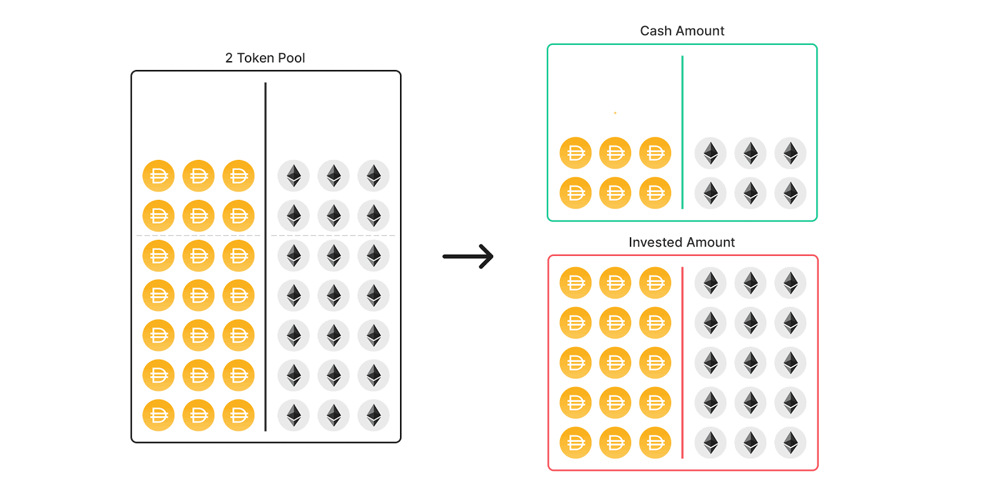
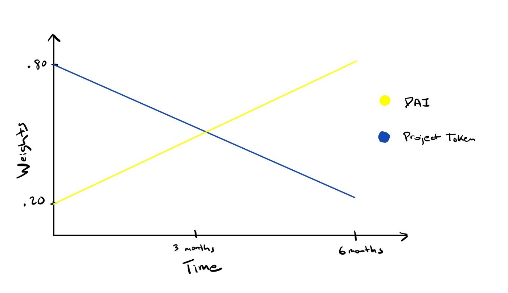

# Balancer

## What is Balancer?

Balancer is a decentralized exchange and portfolio management system that allows anyone to trade and invest ERC-20 tokens. While Uniswap uses a one-size-fits-all approach to pool design, Balancer exposes a tremendous deal of flexibility in liquidity pool design. 

Balancer's Weighted Pools can have up to 8 assets and trade fees ranging from 0.0001% and 10%. Additionally, assets can have unequal weightings, so instead of using 50/50, someone could make a pool that has an 80/20 weighting to reduce [Impermanent Loss](https://explain.eli5defi.info/decentralized-exchanges#what-is-impermanent-loss-il).

## What's the advantage of multi-asset pools?

With multi-asset pools, a trader can come and trade between any two assets in a pool. This means that for a single pool with 8 assets, the liquidity provider is making 28 \(8 choose 2\) different trading pairs available. This high number of pairs means more potential trades, and more opportunities to collect trade fees. 

## What else can Balancer do?

Balancer has created a plug-in model that allows for a great deal of customization. The community can create their own systems to contribute to the Balancer Protocol.

### **Asset Managers**

In a typical trading pool, only a small fraction of the liquidity is used to make trades. Asset Managers are external contracts that take unused liquidity and invest it elsewhere. For example, the Aave Asset Manager takes tokens from Balancer pools and lends them on Aave Protocol.

### **Custom Pool Types**

Balancer Pools can be designed to have any custom logic you might want. For example, in addition to the standard Weighted Pools, Balancer Pools can now also launch with a **StableSwap pricing** equation, which is highly advantageous for trades between assets that have \(nearly\) the same price.

Example use cases:

* Stablecoins
* ERC20 tokens representing Bitcoin
* Different implementations of synthetic stocks

### **Surge Pricing for Smart Pools**

Dynamic Pool Fees bring surge pricing to Smart Pools. [Developed by Gauntlet](https://medium.com/balancer-protocol/balancer-partners-with-gauntlet-to-make-dynamic-fee-pools-a-reality-97b3fb1760df), these variable fees are designed to maximize returns for liquidity providers by getting the most out of their investments.

### **Liquidity Bootstrapping Pools \(LBPs\)**

LBPs ****create opportunity for new projects to [distribute tokens fairly](https://medium.com/balancer-protocol/building-liquidity-into-token-distribution-a49d4286e0d4) and build liquidity to drive development and growth. LBPs start with intentionally high prices to discourage bots and users from scooping up and hoarding all the tokens right as a pool launches. The price gradually decreases, allowing users to buy in at a price they think is fair. Examples of some projects that built liquidity with LBPs include Perpetual Protocol, Radicle, and Illuvium.

## How are prices determined?

Balancer uses a "constant product" formula [like Uniswap does](https://explain.eli5defi.info/decentralized-exchanges/uniswap#how-are-prices-determined), but with the increased number of assets and varied weights of assets in a pool. The equation is just a generalization of xy=k, even if it looks a bit more complicated:

$$
\prod{{x_i}^{w_i}}=k
$$

 Instead of the "xy=k" of the Uniswap formula, Balancer's formula accounts for the custom weight by raising each "x" by its weight's exponent. 

While spot price \(_SP_\) in a two asset Uniswap-style pool can be calculated with:

$$
SP = \frac{B_i}{B_o}
$$

With _Bi_ as the balance of the input and _Bo_ as the balance of the output, a Balancer-style pool calculates spot price accounting for the weights, _Wi_ and _Wo_, of the input and output assets as well.

$$
SP = \frac{(B_i/W_i)}{(B_o/W_o)}
$$

